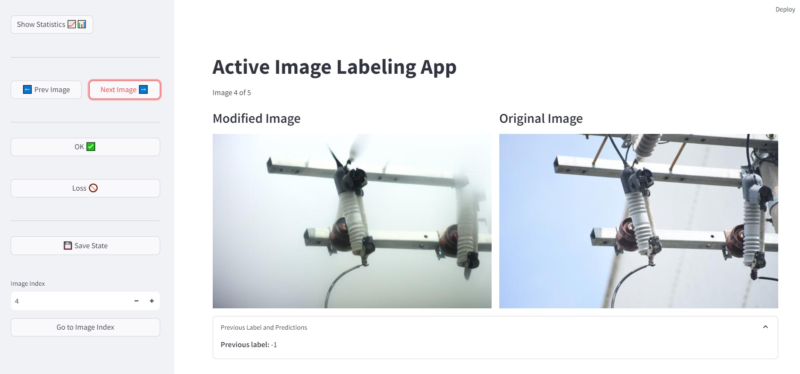
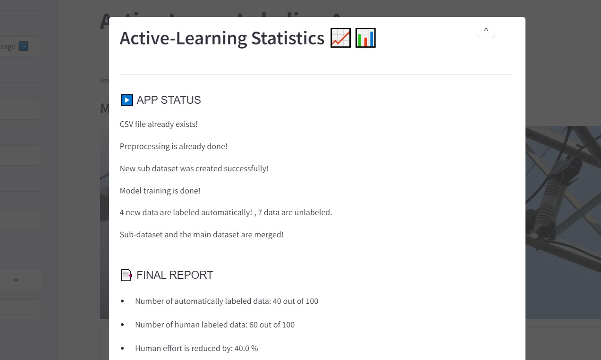
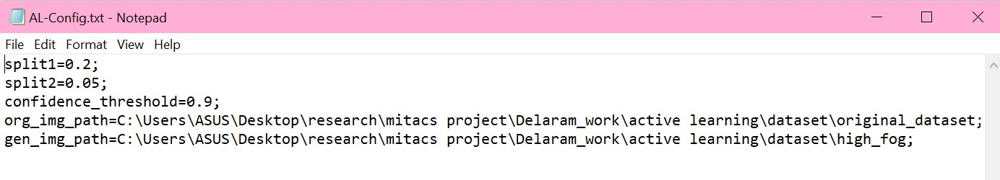
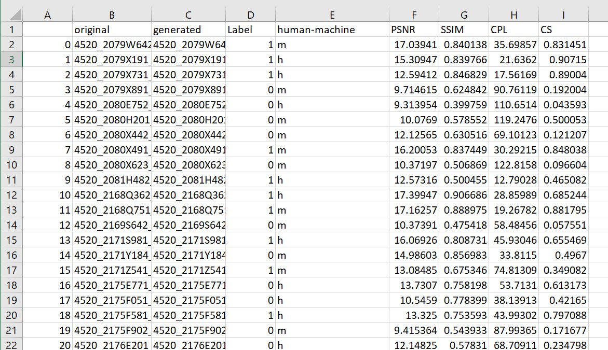

# Active Image Labeling App (AILA)

This repository contains the code for the Active Image Labeling App (AILA), a tool designed for a specialized labeling task. This task requires the annotator to compare an original image with its altered version.  The "Active" term reflects the active-learning backend that the application has. It reduces the human effort in labeling by using an ML-model to automatically label some of the data based on what the ML-model is learning from the human annotator.

     

## Getting Started

To use the application, follow these steps:

1. Clone the repository.
2. Install the required dependencies by running `pip install -r requirements.txt`.
3. Fill the AL-Config.txt file.
   - split1: The portion of the dataset that is used for the initial training. (default = 0.2)
   - split2: The portion of the dataset that is used for tuning the model. (default = 0.05)
   - confidence_threshold: If the confidence of prediction was above this threshold, the app will label that image automatically. (default = 0.9)
   - org_img_path: The path that the original images are stored in.
   - gen_img_path: The path that the generated images are stored in.
     
5. Run the script using `streamlit run app.py`

*Please note that the initial launch requires additional time as the application is generating a .CSV file for the dataset and performing preprocessing on the image pairs.

      

  

## Results

The results are stored in the `AILA_Dataset.csv` file. This file contains eight columns:

1. original: This column stores the names of original images.
2. generated: This column stores the names of generated images.
3. Label: This column stores the labels for each pair of images. 1 is okay, 0 is lost, and -1 is unlabeled.
4. human-machine: This column obtains whether this image is labeled by the human annotator or automatically. h means labeled by human, and m means labeled automatically.
5. Other columns are the extracted features from image pairs that are used for training the ML-model.

